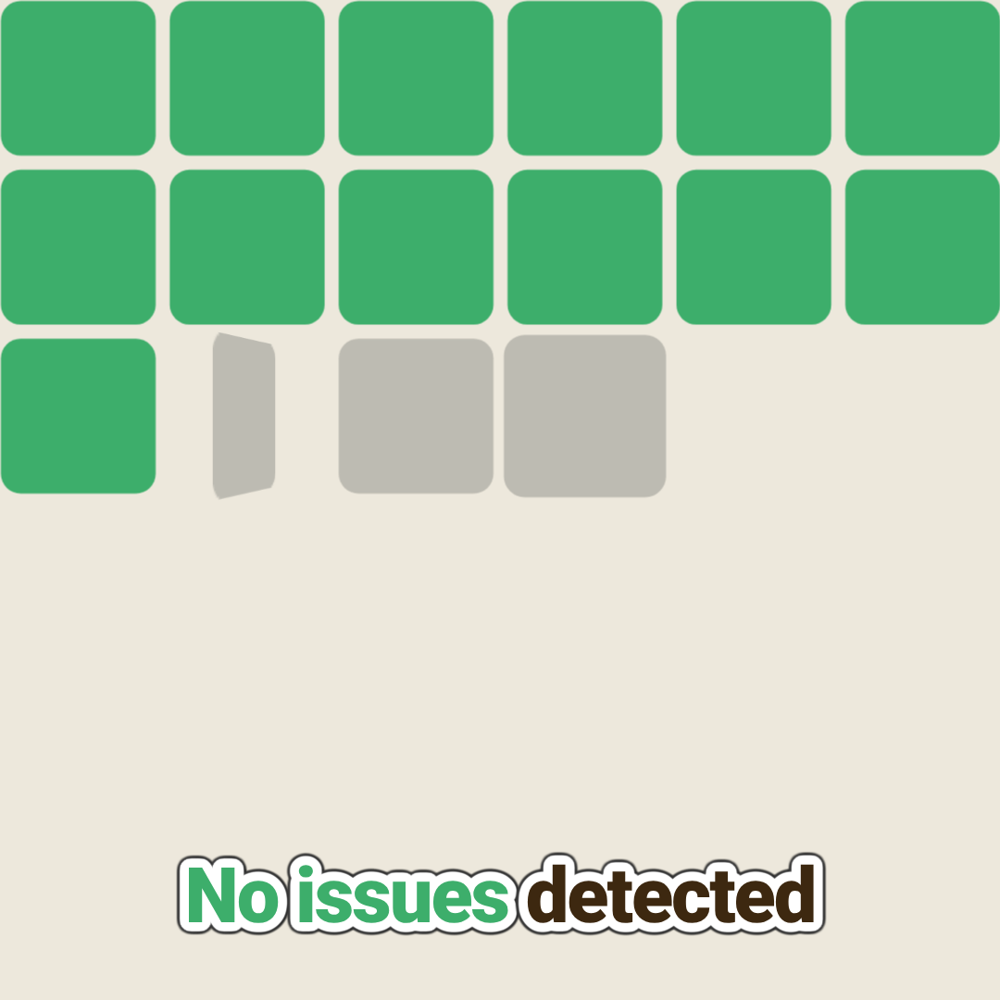
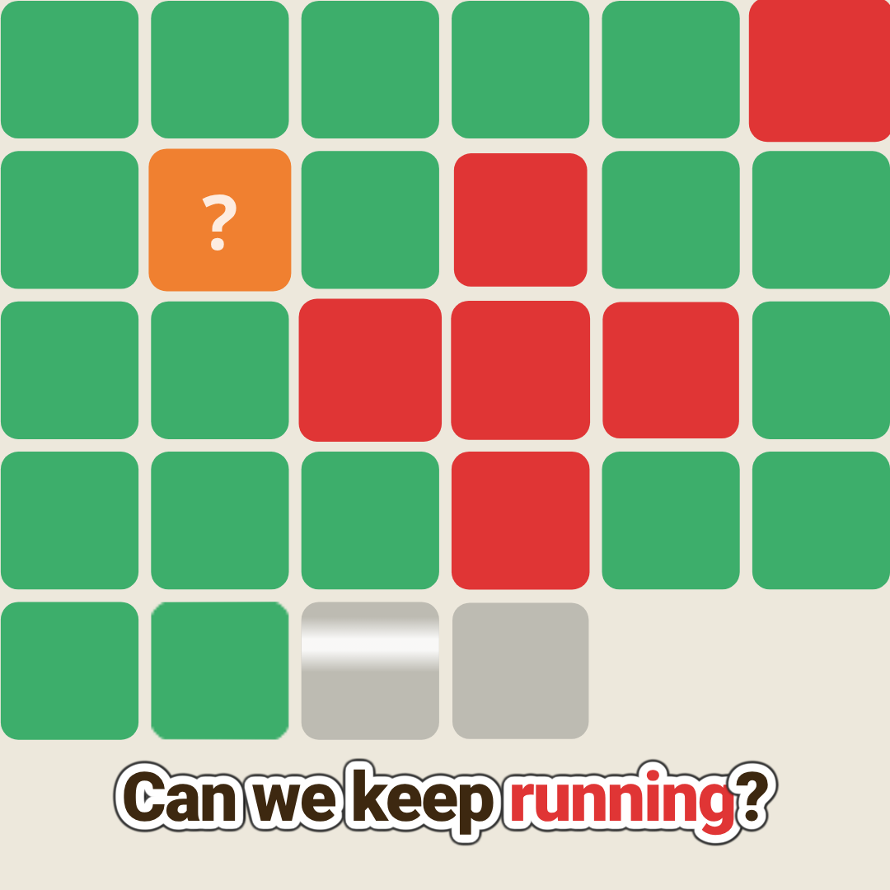
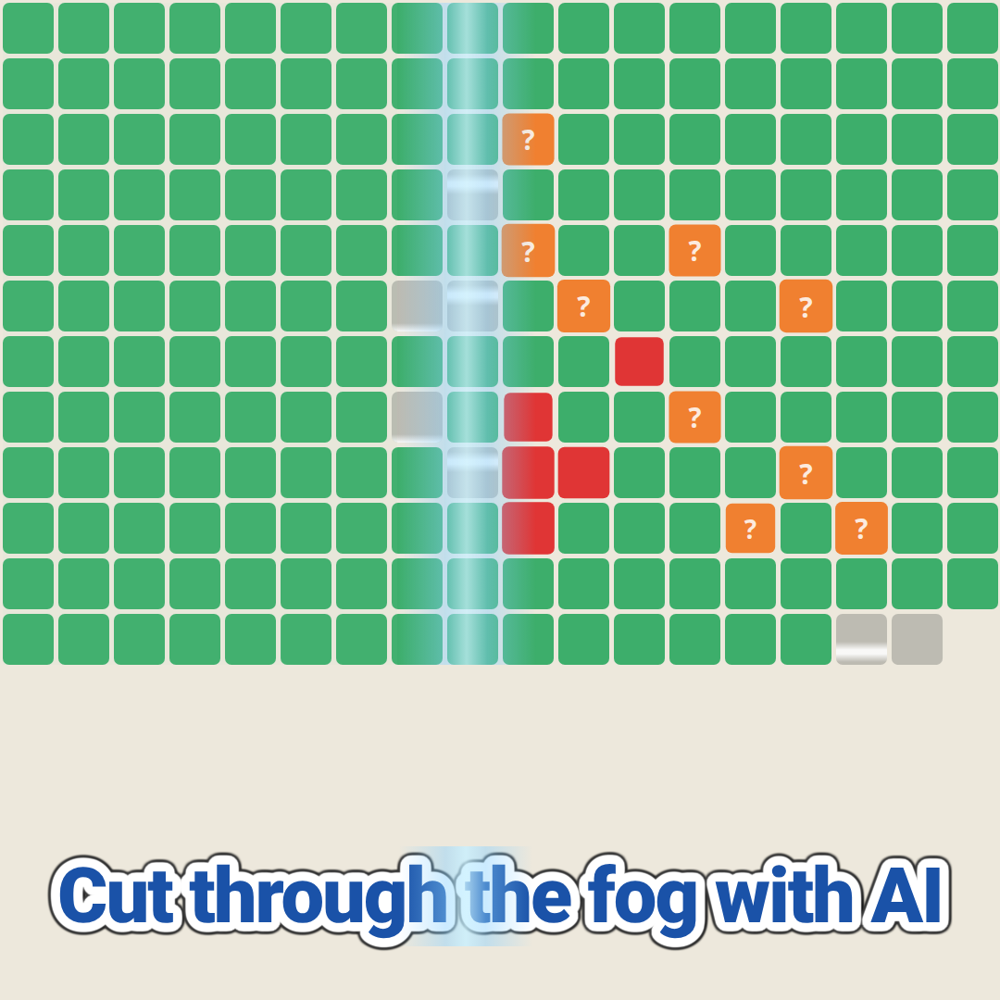
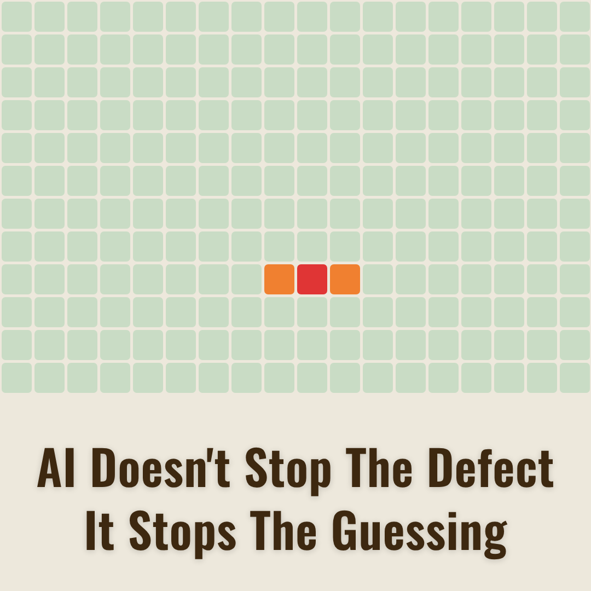

# template-matrix

A [Remotion](https://www.remotion.dev/) template for animated matrix grid videos: an 18×18 grid of cells fills a production zone one by one, a defect propagates through nearby cells with ripple effects, uncertainty spreads as question-mark tiles, and an AI sweep beam resolves the chaos — ending with a clean slogan reveal. Built for 1:1 square format at 30 fps.

<p align="center">
  <a href="assets/template01.png"></a>
  <a href="assets/template02.png"></a>
  <br/>
  <a href="assets/template03.png"></a>
  <a href="assets/template04.png"></a>
</p>

## Using with an AI agent

Give this single line to Claude Code, Gemini, Codex, or any coding agent and it will know exactly what to do:

```
Clone https://github.com/davidtweeto/template-matrix, run npm install, then edit the defaultProps in src/Root.tsx to set the slogan font, edit the ENTRIES array in src/components/TextOverlay.tsx to set your text captions, and run npm run dev to preview in Remotion Studio.
```

For best results, also install the Remotion skill so your agent has deep Remotion domain knowledge:

```bash
npx skills add remotion-dev/skills
```

## Quick start

```bash
npm install
npm run dev
```

Open [http://localhost:3000](http://localhost:3000) in your browser to preview in Remotion Studio.

## Customizing content

All composition props are editable live in Remotion Studio via the Props panel. The schema is defined in `src/Composition.tsx` using Zod. Edit `defaultProps` in `src/Root.tsx` to set your own values:

| Prop | What it controls |
|---|---|
| `fontSize` | Font size for sticker-style captions (px) |
| `whiteStroke` | White outline thickness around sticker text |
| `blackStroke` | Dark shadow thickness around sticker text |
| `sloganFont` | Font for the closing slogan: `roboto`, `playfair`, `montserrat`, `oswald`, or `raleway` |
| `sloganFontSize` | Font size for the closing slogan (px) |
| `sloganTitleCase` | Automatically title-case the slogan text |
| `watermark` | Watermark text in the bottom-right corner (empty string to hide) |

### Changing the text captions

The caption sequence is defined in the `ENTRIES` array in `src/components/TextOverlay.tsx`. Each entry has:

- `from` / `to` — frame range when the caption is visible
- `lines` — array of lines; each line is a plain string or an array of `{ text, color? }` segments for inline color highlights
- `professional: true` — use the slogan font with a fade-in (for the closing statement)
- `sweep: true` — add a light-beam sweep effect across the text (for the AI reveal moment)
- `fadeOutFrames` — fade the caption out over N frames before it disappears

### Changing the grid behavior

Key parameters in `src/constants.ts`:

| Constant | What it controls |
|---|---|
| `DEFECT_R` / `DEFECT_C` | Row/column of the defect cell in the large 18×18 grid |
| `RIPPLE` | Neighboring cells that react to the defect (with delay, confirmed status, and final color) |
| `Q_MARKS` | Cells that flip to orange question-marks during Scene 3 |
| `PROD_INT` | Frames between each new cell appearing (~0.5s at 30fps) |
| `ZOOM_IN` / `ZOOM_OUT` | Scale for the intro close-up and the zoom-out reveal |
| `BG` | Background color (default: off-white `#EDE8DC`) |

## Animation sequence

The video runs at 30 fps for 895 frames (~30 seconds):

| Time | Event |
|---|---|
| 0s | Grid zoomed into production zone, cells fill one by one with scan flips |
| 8s | Captions appear: "Part OK", "Quality OK", "Line running"… |
| 9.5s | Defect turns red, ripple cells react — captions ask "Is it isolated? spreading? Can we keep running?" |
| 14s | Zoom-out reveals the full 18×18 grid; question marks spread across surrounding cells |
| 19s | "Cut through the fog with AI" text with sweep-beam effect |
| 19s | AI sweep beam crosses the grid left to right, resolving all question marks and ripple cells |
| 22s | Closing slogan fades in: "AI doesn't stop the defect — It stops the guessing" |
| 30s | Green cells fade out, red/orange persist briefly, then all fade to background |

## Cell color system

| Color | Meaning |
|---|---|
| Gray | Newly produced — scan in progress |
| Green | Checked and OK |
| Red | Defect or confirmed affected |
| Orange | Potentially affected / at-risk |
| Orange + `?` | Unknown / uncertain state |

Every cell animates with a spring pop-in, a top-to-bottom scan sweep bar, and a 3D Y-axis card flip when transitioning between states.

## Sound effects

Audio files are sourced from [Pixabay](https://pixabay.com/service/license-summary/) and are **not included in this repository** (Pixabay's license prohibits standalone redistribution). Download each file, rename it exactly as shown, and place it in `public/sfx/`:

| Filename | Pixabay page |
|---|---|
| `alex_jauk-industrial-ambience-223058.mp3` | [Industrial Ambience – alex_jauk](https://pixabay.com/sound-effects/industrial-ambience-223058/) |
| `freesound_community-industrial-ambience-67112.mp3` | [Industrial Ambience – freesound_community](https://pixabay.com/sound-effects/industrial-ambience-67112/) |
| `freesound_community-stamp-102627.mp3` | [Stamp – freesound_community](https://pixabay.com/sound-effects/stamp-102627/) |
| `kamranbashirb-car-door-shut-297266.mp3` | [Car Door Shut – kamranbashirb](https://pixabay.com/sound-effects/car-door-shut-297266/) |
| `lesiakower-error-mistake-sound-effect-incorrect-answer-437420.mp3` | [Error/Incorrect Answer – lesiakower](https://pixabay.com/sound-effects/error-mistake-sound-effect-incorrect-answer-437420/) |
| `stereogenicstudio-swish-swoosh-woosh-sfx-53-357158.mp3` | [Swish/Swoosh – stereogenicstudio](https://pixabay.com/sound-effects/swish-swoosh-woosh-sfx-53-357158/) |
| `u_ayf470ljcu-incorrect-buzzer-sound-147336.mp3` | [Incorrect Buzzer – u_ayf470ljcu](https://pixabay.com/sound-effects/incorrect-buzzer-sound-147336/) |
| `universfield-new-notification-07-210334.mp3` | [New Notification 07 – universfield](https://pixabay.com/sound-effects/new-notification-07-210334/) |

The composition uses these sounds for: industrial ambiance loops, per-cell scan ticks, defect alert buzzer, ripple tension hits, zoom-out whips, AI sweep whoosh, sticker-text stamps, and resolution dings.

To silence everything, remove `<SoundEffects />` from `src/Composition.tsx`.

## Rendering

```bash
# Render the full video
npm run render

# Render a single frame for layout checks
npx remotion still Matrix --frame=30 --scale=0.5
```

Output lands in `out/`.

## Structure

```
src/
  index.ts                — Remotion entry point
  Root.tsx                — Composition registration & default props
  Composition.tsx         — Main animation component + Zod schema
  constants.ts            — Grid geometry, scene timing, palette, animation params
  types.ts                — CellData interface
  components/
    MatrixGrid.tsx        — Renders all cells + sweep overlays
    Cell.tsx              — Individual cell with spring pop, pulse, scan bar, card flip
    CardFlip.tsx          — 3D Y-axis card flip (gray→color or green→red/orange)
    AISweep.tsx           — Full-grid AI sweep beam overlay
    ScanLine.tsx          — Stub (per-cell sweep used instead)
    RedClusterOutline.tsx — Outline around confirmed-red cluster in Scene 5
    TextOverlay.tsx       — Sticker-style captions + closing slogan
    SoundEffects.tsx      — All audio cues wired to frame offsets
  utils/
    grid.ts               — Pure function computing CellData for every cell at every frame
public/
  sfx/                    — MP3 sound effect files
```

## Built with Remotion

This template is built on [Remotion](https://www.remotion.dev/) — a framework for creating videos programmatically in React.

- Website: [remotion.dev](https://www.remotion.dev/)
- GitHub: [github.com/remotion-dev/remotion](https://github.com/remotion-dev/remotion)
